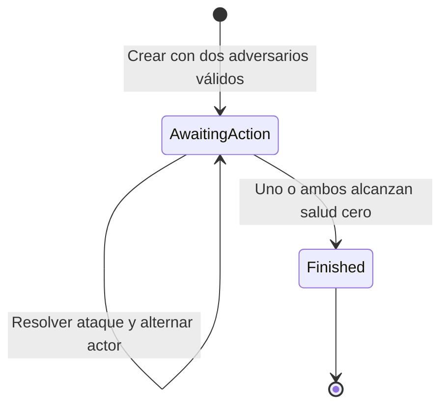

# Ejercicio 3: combate por turnos

Los ejemplos HTTP requieren un token Bearer de Keycloak. Antes de ejecutar los scripts, configura `POKEMON_CLIENT_SECRET` o `POKEMON_ACCESS_TOKEN` como explica [autenticación](autenticacion.md). Scalar dispone de login interactivo.

Una partida enfrenta dos ejemplares de la Pokédex. Al crearla se copian sus características, salud y cuatro movimientos. A partir de ese momento la partida conserva su propia salud: combatir no daña los ejemplares de la colección y editar o eliminar su ficha no cambia una partida ya iniciada.

## Contrato HTTP

| Operación | Petición | Resultado |
| --- | --- | --- |
| Crear partida | `POST /battles` con firstPokemonId y secondPokemonId | 201, Location y estado inicial |
| Consultar partida | `GET /battles/{id}` | 200, estado e historial completos |
| Resolver una acción | `POST /battles/{id}/turns` con pokemonId, moveId y expectedVersion | 200, nueva versión de la partida |

Los dos adversarios deben existir, ser distintos y tener salud positiva. Pueden participar en varias partidas independientes. La API elige el primer actor por mayor velocidad; si empatan, comienza firstPokemonId. Después se alternan estrictamente las acciones.

La respuesta indica `phase`, `version`, `nextPokemonId`, `winnerId`, `isDraw`, ambos participantes y `turns`. Cada participante incluye salud, estadísticas y movimientos con `remainingUses`. El cliente selecciona un movimiento del actor indicado por nextPokemonId y envía la versión que acaba de leer.

```json
{
  "pokemonId": "00000000-0000-0000-0000-000000000201",
  "moveId": "00000000-0000-0000-0000-000000000002",
  "expectedVersion": 1
}
```

Este ejemplo sirve para la primera acción de Charmander frente a Squirtle, con los datos iniciales. El identificador de partida de la URL se obtiene del POST de creación. Todos los campos son obligatorios; moveId puede ser explícitamente null únicamente para el esfuerzo descrito más abajo.

## Fases y resolución



Una acción resuelve de forma atómica la validación del turno, selección del movimiento, cálculo de daño, consumo de usos y comprobación de derrota. No se guarda un estado intermedio con daño aplicado y turno sin avanzar. El historial representa cada acción ya resuelta, numerada desde 1.

Los ataques normales reutilizan exactamente DamageCalculator del ejercicio 1: tipo del movimiento contra tipo del defensor y un factor aleatorio entero 85–100. El historial incluye daño calculado, daño realmente aplicado, efectividad, azar y salud de ambos tras la acción. El daño aplicado se limita a la salud que queda: nunca se guardan valores negativos.

Cuando un participante alcanza cero, la fase pasa a Finished y no hay siguiente actor. El contrario gana si conserva salud. Si ambos llegan a cero por el esfuerzo y su retroceso, el resultado es empate. Una partida terminada no acepta más acciones.

## Usos y esfuerzo: evitar combates infinitos

Cada uno de los cuatro movimientos empieza con **cinco usos por partida**. Se consume un uso incluso cuando la inmunidad o el redondeo producen cero daño. Un movimiento agotado no se puede seleccionar.

Cuando todos los movimientos del actor están agotados, la respuesta indica `canStruggle: true`. El cliente envía `moveId: null` para utilizar Struggle, aquí denominado esfuerzo. Tiene estas reglas propias de la solución:

- Daño al rival: máximo entre 1 y el 10 % de su salud total, redondeado hacia abajo.
- Retroceso sobre el atacante: máximo entre 1 y el 10 % de su propia salud total, redondeado hacia abajo.
- Ambos se limitan a la salud que queda; el retroceso se aplica aunque el rival llegue a cero.
- No intervienen inmunidades ni azar. El historial devuelve null en effectiveness y randomFactor.

Estas reglas no pretenden reproducir el esfuerzo oficial de los videojuegos. Permiten terminar incluso cuando todos los ataques normales son inútiles. Hay como máximo 40 acciones normales entre ambos adversarios y como máximo 19 esfuerzos antes de que uno alcance cero con los límites del modelo. Si el cliente sigue enviando acciones válidas, la partida termina en menos de 60 acciones. La API no avanza por sí sola mientras el cliente está inactivo.

## Concurrencia y errores

Version empieza en 1 y aumenta una unidad por acción aceptada. expectedVersion es una precondición: dos peticiones simultáneas con la misma versión no ejecutan dos ataques. Una se guarda y la otra recibe 409. Comprobación de versión, selección, azar y publicación se realizan dentro de la misma sección transaccional.

Un reintento con una versión antigua recibe 409 y no consume movimientos ni azar. Si se pierde una respuesta, el cliente consulta la partida antes de decidir su siguiente acción; no debe incrementar la versión a ciegas. La creación de partidas no utiliza una clave de idempotencia: repetir POST /battles crea otra partida independiente.

Errores con ProblemDetails y traceId:

| Estado | Motivo |
| --- | --- |
| 400 | JSON incompleto o inválido, identidad vacía, adversarios repetidos o sin salud, versión no positiva |
| 404 | Partida o ejemplar solicitado inexistente |
| 409 | Versión antigua, actor equivocado, movimiento no aprendido o agotado, esfuerzo prematuro o partida finalizada |
| 415 | Tipo de contenido no admitido |
| 500 | Fallo interno; sin detalles técnicos en la respuesta |

Un fallo o cancelación antes de publicar conserva el estado anterior. Un fallo del proveedor aleatorio tampoco consume un turno. Las peticiones heredan trazas, logs correlacionados y métricas de MediatR.

## Arquitectura y límites

Battle es la raíz del agregado y concentra las reglas. BattlePokemon y BattleMove son datos internos inmutables de la partida. El historial también es inmutable y se expone como colección de solo lectura. Application/Feature/Battle contiene dos Commands, una Query, contratos HTTP y mapeo de snapshots. El contrato IBattleRepository pertenece a Domain/Battle/Repositories. La API únicamente adapta HTTP.

Infrastructure/Battle implementa IBattleRepository con PostgreSQL en el modo normal. Las partidas sobreviven al reinicio y las acciones se confirman con bloqueo por fila y transacciones. El adaptador en memoria existe únicamente en el proyecto de pruebas. El esquema, el formato durable, las migraciones y sus límites están en [persistencia](persistencia.md).

Se mantienen las simplificaciones de los ejercicios anteriores: un tipo por Pokémon, estadísticas normales para el daño y ataques de potencia fija. No se añaden objetos, estados alterados, cambios de Pokémon, experiencia, evolución, prioridad especial de movimientos ni inteligencia artificial. Los clientes eligen ambos ataques; el script de demostración automatiza esa elección tomando el primer movimiento con usos.

## Demostración y pruebas

Arranca con Docker según el README. En Scalar, el grupo Battle incluye un ejemplo de creación usando Charmander y Squirtle. Para ejecutar una partida completa en una API real:

```powershell
./scripts/verify-battle.ps1 -BaseUrl http://localhost:51966
```

El script muestra cada acción, comprueba la finalización y su consulta posterior, verifica el rechazo de acciones tras el final y confirma que la salud de la Pokédex no cambia. La partida terminada queda guardada en PostgreSQL y sigue consultable después de reiniciar la API.

Las pruebas cubren velocidad y empate inicial, daño y límites de salud, consumo, inmunidades, redondeo a cero, agotamiento, esfuerzo y retroceso, ganador y empate, historial inmutable, snapshots, partidas independientes, cancelación, rollback, 500 saneado, contratos JSON, concurrencia y un combate HTTP completo. La suite incluye las regresiones de los ejercicios 1 y 2.

Verificación inicial del combate, antes de incorporar PostgreSQL: 549 pruebas superadas en Windows y durante la construcción Linux de Docker. El script de combate completó una partida real en diez acciones, comprobó el estado final, el rechazo posterior con 409 y la salud intacta de la colección. Scalar y Aspire respondieron HTTP 200. El resultado de otra ejecución puede variar por el factor aleatorio.

La ampliación de persistencia se verifica con 601 casos generales y 20 casos PostgreSQL reales, además del recorrido de reinicio documentado en persistencia.md.
