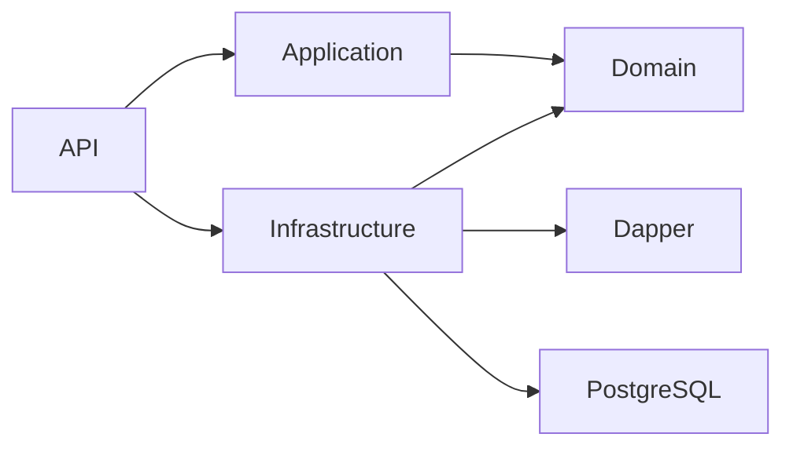

# Revisión arquitectónica: SOLID, DDD, CQRS y persistencia

## Alcance y criterio de cierre

Se revisan Domain, Application, Infrastructure, API, pruebas y despliegue. Se conservan contratos HTTP, datos PostgreSQL, autenticación Keycloak, cálculo de daño y reglas de combate. La revisión se cierra con pruebas de arquitectura, regresión HTTP, PostgreSQL real y una segunda revisión del resultado.

## Hallazgos de la primera iteración

1. El contrato de Pokédex expone colecciones completas. Acopla los casos de uso a un snapshot global e impide consultas selectivas.
2. Queries y Commands reciben el mismo puerto con lectura y escritura. La separación CQRS depende de convenciones.
3. Los repositorios síncronos simulan almacenamiento sobre diccionarios y aplazan la E/S. El contrato debe expresar operaciones asíncronas de persistencia.
4. Los filtros y búsquedas cargan datos que no participan en la operación. Deben traducirse a consultas parametrizadas en Infrastructure.
5. Las listas carecen de paginación. El crecimiento del catálogo aumenta trabajo y tamaño de respuesta sin límite.
6. Los nombres Postgres se propagan por demasiadas clases de Infrastructure. Los nombres de los repositorios deben describir su agregado; la elección tecnológica se concentra en la implementación y la composición.
7. El comportamiento transversal de MediatR vive en API aunque observa casos de uso independientes de HTTP.
8. Las comprobaciones de compatibilidad de un plan de aprendizaje son reglas de dominio y deben quedar explícitas como tales.

Las entidades de dominio no contienen tipos de Npgsql, SQL ni atributos de almacenamiento. La presencia de una implementación PostgreSQL dentro de Infrastructure no es, por sí sola, una dependencia del dominio.

## Diseño de la segunda iteración

- Contratos de repositorio por agregado en Domain, con lectura asíncrona y búsqueda selectiva.
- Interfaces de lectura segregadas de escritura. Las consultas de Application solo reciben el puerto de lectura; los comandos reciben una unidad de trabajo.
- Transacciones asíncronas que conservan atomicidad y coherencia sin precargar todo el catálogo.
- Repositorios de Infrastructure con Dapper 2.1.79, SQL parametrizado, modelos de fila privados y mapeo explícito a agregados.
- Sesión y fábrica de conexiones internas de Infrastructure; ningún contrato público de dominio expone Dapper, Npgsql, SQL ni conexiones.
- Lecturas por identidad y listas paginadas. Relaciones cargadas en lotes para evitar una consulta por elemento.
- Marcadores ICommand/IQuery sobre MediatR y pruebas que impidan mezclar sus dependencias.
- Migraciones y volúmenes existentes conservados. El bloqueo transaccional del catálogo y el bloqueo por partida se mantienen hasta validar alternativas con requisitos de concurrencia concretos.

## Dependencias

API es la raíz de composición. Domain define reglas y contratos. Application coordina los casos de uso. Infrastructure materializa los contratos y concentra las decisiones de almacenamiento.

## Revisión posterior

Los ocho hallazgos de la primera revisión están corregidos. La segunda revisión añadió dos ajustes: `IBattleReader` para segregar la lectura de partidas, y `StatsView` para desacoplar respuestas de entradas. Se eliminaron párrafos obsoletos que todavía describían pérdida de datos o ausencia de autenticación.

| Aspecto revisado | Resultado y evidencia |
|---|---|
| Dependencias y SOLID | Domain sin referencias exteriores; Infrastructure depende de Domain; puertos segregados; implementaciones internas. Pruebas de arquitectura. |
| DDD | Agregados inmutables con invariantes; LearningPolicy protege cambios del aprendizaje; turnos e historial pertenecen a Battle. |
| CQRS | Todas las solicitudes tienen marcador Command o Query; lectores sin escritura; telemetría transversal en Application. |
| Persistencia | Dapper parametrizado en Infrastructure; E/S asíncrona con cancelación; transacción por operación; sin cargas globales. |
| Consistencia | Rollback conjunto, lectura repetible, unicidad concurrente, bloqueo por partida y rechazo de versiones obsoletas verificados con PostgreSQL. |
| Consultas | Paginación y relaciones por lotes; una consulta por identidad sigue funcionando aunque otro agregado almacenado esté corrupto. |
| Compatibilidad | Mismas rutas y propiedades JSON; `offset` y `limit` son opcionales. Nuevas listas limitadas a 100 por defecto. DDL y formato de partidas sin cambios. |
| Seguridad y errores | Keycloak y políticas HTTP conservados; parámetros SQL separados de datos; errores de almacenamiento no se presentan como validación del usuario. |

Verificación automatizada: **601 pruebas generales en Windows y Docker Linux, más 20 contra PostgreSQL real**, todas superadas y sin omisiones en sus ejecuciones respectivas. La compilación no emitió advertencias. Las pruebas SQL crean y eliminan únicamente esquemas temporales propios. La API Docker se actualizó conservando el catálogo y la partida existente: comparación completa antes/después sin diferencias. Las 24 operaciones HTTP rechazaron acceso anónimo; el token real de Keycloak permitió readiness, OpenAPI y Scalar. La recreación del contenedor PostgreSQL y el reinicio de la API conservaron los datos de la prueba de persistencia.

La primera iteración con Dapper está en `8dcd347` y la unidad de trabajo común con excepciones por módulo en `535fccd`, dentro de `refactor/solid-cqrs-dapper`. `main` no se ha modificado y no se ha publicado esta revisión en un remoto.

## Decisiones y límites asumidos

- PostgreSQL y Dapper son elecciones de Infrastructure. Un nombre concreto de proveedor en esa capa sería válido; lo esencial es que no aparezca en contratos ni entidades del dominio. Renombrar clases por sí solo no produce DDD.
- CQRS comparte base de datos y mantiene consistencia inmediata. No hay necesidad actual de replicación, bus de eventos ni event sourcing.
- El catálogo serializa escrituras para proteger reglas entre agregados. Escala en lectura mediante filtros y páginas, pero no se ha medido su capacidad bajo una carga de producción. La revisión de planes de aprendizaje consulta todos los ejemplares de la especie afectada para validar su integridad.
- Las páginas usan offset, sin prometer una instantánea compartida entre peticiones distintas. Los PUT del catálogo siguen la regla de última escritura válida; las partidas sí exigen versión del cliente.
- La colección es compartida entre usuarios autenticados. Autenticación y propiedad individual son requisitos distintos; no se ha inventado un modelo de propietarios que la prueba no pide.
- No se incorpora Valkey sin una necesidad medida. PostgreSQL sigue siendo la fuente de datos duradera.
- Las decisiones anteriores se documentan como límites del diseño, no como garantías de perfección o escalabilidad ilimitada.

## Recorrido para defender la solución

1. Empezar por una Query (`GetMoveQueryHandler`) y seguir su puerto de lectura hasta `MoveRepository`: el contrato no conoce cómo se almacena un movimiento.
2. Seguir `UpdateSpeciesCommandHandler`: obtiene hechos, valida LearningPolicy, guarda y proyecta dentro de una transacción. Si algo falla, no publica cambios.
3. Seguir `PlayTurnCommandHandler` y `BattleRepository.Update`: la raíz controla el turno y el repositorio garantiza atomicidad frente a otras peticiones.
4. Mostrar las pruebas de arquitectura, las de PostgreSQL y el documento de persistencia para justificar decisiones con comportamiento verificable.

## Tercera iteración: unidad de trabajo común

La coordinación transaccional se trasladó a Domain/Common/Persistence. Se eliminaron los contratos y sesiones específicos de Pokédex. `DatabaseUnitOfWork` sirve tanto al catálogo como a las partidas y no conoce sus contratos concretos: `RepositoryRegistry` registra las fábricas y `RepositoryScope` resuelve y reutiliza sus instancias bajo demanda.

Las excepciones de Domain se agrupan por módulo en carpetas Exceptions. Las reglas auxiliares se mantienen en clases propias, separadas de las declaraciones de error.

Las pruebas adicionales comprueban creación diferida, reutilización dentro de una operación, instancias independientes entre operaciones, extensibilidad mediante registro, imposibilidad de resolver escritores en lectura y confirmación/rollback conjunto de catálogo y combate. Las pruebas de concurrencia por partida y entre escritores del catálogo siguen formando parte de la suite.

La imagen final con la unidad de trabajo común se verificó con Keycloak real: catálogo y partida previa idénticos, readiness/OpenAPI/Scalar accesibles con token, acceso anónimo rechazado y creación/consulta/conflicto por duplicado/eliminación comprobados. Se limpiaron los datos temporales y el catálogo conserva 21 movimientos, cinco especies y cinco ejemplares.
